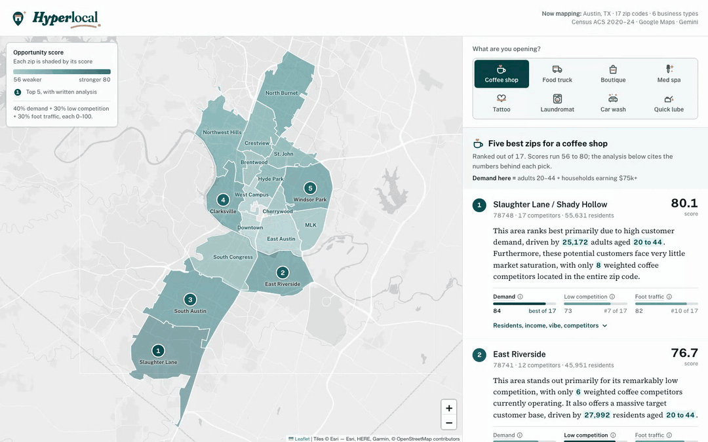
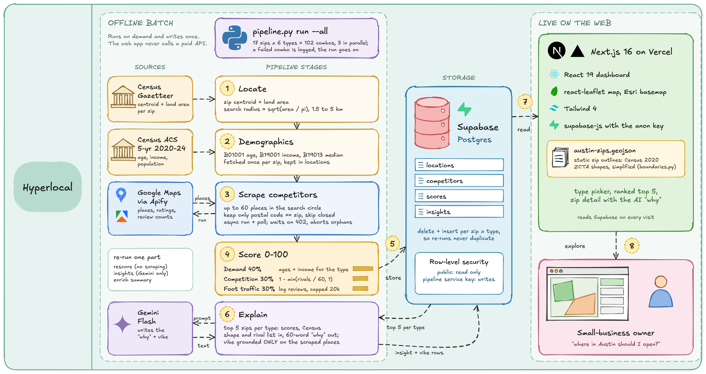

# Hyperlocal

> 🏆 **3rd place at the [Cursor Austin × AITX Hackathon](https://luma.com/cursor-austin-grok-001)** (Austin, TX, September 19, 2026). Built during the event by [Mahesh Babu Gorantla](https://github.com/maheshbabugorantla), [Sreedhar Arolla](https://github.com/sreedhararolla), [Chase Young](https://github.com/Chaser263), and [Dennis Popov](https://github.com/dennycrafter).

**Find the block where your business belongs.** Hyperlocal scores every neighborhood for a small business on who lives there, who you'd compete with, and how busy the streets already are. Pick a location on evidence, not gut feel.

- **Live app:** https://hyperlocal-sigma.vercel.app
- **Repo:** https://github.com/maheshbabugorantla/hyperlocal (public)
- **Now mapping:** Austin, TX: 17 central zip codes × 6 business types (coffee shop, food truck / pop-up, boutique retail, med spa, tattoo studio, laundromat)

The app shows a map of real zip outlines shaded by score, a ranked top 5 per business type, and a detail panel for every zip. The panel covers:
- a plain-English analysis of the score
- age and income breakdowns against the 17-zip average
- a neighborhood "vibe"
- the actual competitors you'd face
- a hover explanation of how each sub-score is computed



## Quick start

Prerequisites: Node 20+, Python 3.10+ ([uv](https://docs.astral.sh/uv/) recommended), and a Supabase project.

```bash
git clone https://github.com/maheshbabugorantla/hyperlocal.git && cd hyperlocal

# 1. Secrets: see "How to reproduce" below for where each key comes from
cp .env.example .env          # pipeline keys
cp .env.example .env.local    # only the NEXT_PUBLIC_* keys are read by the app

# 2. Python pipeline
uv venv --python 3.12 pipeline/.venv
VIRTUAL_ENV=pipeline/.venv uv pip install -r pipeline/requirements.txt
PY=pipeline/.venv/bin/python

$PY pipeline/pipeline.py schema     # create tables (needs SUPABASE_DB_URL), or paste pipeline/schema.sql into the Supabase SQL Editor
$PY pipeline/pipeline.py check      # confirms every key and makes one real call per service
$PY pipeline/pipeline.py run --zip 78702 --type "coffee shop"   # one zip end to end (~30 s)
$PY pipeline/pipeline.py run --all  # all 17 zips x 6 types, then insights + vibes (~30-40 min)

# 3. Web app
npm install
npm run dev                         # http://localhost:3000

# 4. Deploy (optional)
npx vercel --prod                   # set the two NEXT_PUBLIC_* vars in the Vercel project first
```

Other pipeline commands. None of them scrape, so they're free apart from Gemini:

| Command | What it does |
|---|---|
| `run --all --types "med spa" laundromat` | Scrape and score only the listed types |
| `rescore` | Recompute every score from stored data after changing a constant |
| `enrich` | Backfill age/income breakdowns and vibes |
| `insights` | Regenerate all written analyses (102) and vibes (17), 8 at a time |
| `summary` | Print the score table |
| `python pipeline/boundaries.py` | Rebuild `public/austin-zips.geojson` from the Census boundary file |

## Tech stack & architecture

| Layer | Tech |
|---|---|
| Data pipeline | Python 3.12: `requests`, `supabase`, `google-genai`, `pyshp` + `shapely` (zip outlines) |
| Database | Supabase Postgres. Row-level security allows public **read-only** access; only the pipeline's secret key writes |
| Web app | Next.js 16 (App Router), React 19, Tailwind 4, react-leaflet 5 with Esri light-gray tiles, deployed on Vercel |
| AI | Google Gemini Flash writes each zip's analysis and neighborhood vibe, grounded only in the data it's given |



Vector version: [`docs/diagrams/system-architecture.svg`](docs/diagrams/system-architecture.svg).

Plain-text version:

```
 Census ACS 5-yr ──┐                          ┌── locations    demographics, age/income bands, vibe (1 row / zip)
 Census Gazetteer ─┤                          ├── competitors  Google Maps places (per zip × type)
 Google Maps/Apify ┼─► pipeline/pipeline.py ──┼── scores       demand / competition / traffic / total (per zip × type)
 Gemini Flash ─────┘   fetch · score · explain└── insights     written analysis (every zip × type)
 Census boundaries ──► pipeline/boundaries.py ──► public/austin-zips.geojson (static zip outlines)
                                                         │  Supabase (RLS: public read)
                                                         ▼
                                    Next.js on Vercel (publishable key, read-only)
                                    map + type selector + ranked list + zip detail
```

### Scoring

Each zip × business type gets a score from 0 to 100: **40% demand + 30% low competition + 30% foot traffic**. Every constant is named at the top of `pipeline/pipeline.py`, and the app explains each sub-score on hover.

| Component | Weight | Formula |
|---|---|---|
| Demand | 40% | 50% × min(target-age residents / 20,000, 1) + 50% × share of households in the target income range (see below) |
| Low competition | 30% | 1 − min(same-type businesses inside the zip / 60, 1) |
| Foot traffic | 30% | log10(1 + total Google reviews of those businesses) / log10(1 + 20,000), capped at 1 |

The demand score targets a different customer for each business type:

| Type | Target residents | Target households |
|---|---|---|
| Coffee shop, food truck, boutique retail | 20–44 | earning $75k+ |
| Med spa | 35–64 | earning $100k+ |
| Tattoo studio | 18–34 | any income (demand = population only) |
| Laundromat | 18–34 | earning under $50k |

Research behind the three newer types: [`docs/research/business-types.md`](docs/research/business-types.md). The scales are fixed rather than relative to the other zips, so each score stands on its own and reruns stay stable. The map's shading is relative within the selected type, so the spread is easy to see.

## How to reproduce the demo

### 1. Get the keys

| Variable | Used by | Where to get it | Cost |
|---|---|---|---|
| `SUPABASE_URL` | pipeline | Supabase → Project Settings → API | free tier |
| `SUPABASE_SERVICE_KEY` (or `SUPABASE_SECRET_KEY`, a new-style `sb_secret_…` key) | pipeline (writes) | Supabase → Project Settings → API keys | |
| `SUPABASE_DB_URL` | `pipeline.py schema` only | Supabase → Connect → Connection string (URI, with your DB password) | |
| `CENSUS_API_KEY` | pipeline | https://api.census.gov/data/key_signup.html (arrives by email in about a minute) | free |
| `APIFY_TOKEN` | pipeline | Apify console → Settings → API & Integrations | about $0.30 per zip × type scrape; a full run is about $15–20 |
| `GEMINI_API_KEY` | pipeline | Google AI Studio → API keys | a few cents per full insights run |
| `GEMINI_MODEL` (optional) | pipeline | defaults to `gemini-3.8-flash`; `check` lists valid Flash models if yours differs | |
| `NEXT_PUBLIC_SUPABASE_URL` | web app | same as `SUPABASE_URL` | |
| `NEXT_PUBLIC_SUPABASE_ANON_KEY` | web app | the anon or `sb_publishable_…` key. Safe in the browser: RLS makes it read-only | |

### 2. Sample `.env` (also in [`.env.example`](.env.example))

```bash
# Pipeline: secret, never ship to the browser
SUPABASE_URL=https://<project-ref>.supabase.co
SUPABASE_SERVICE_KEY=sb_secret_...
CENSUS_API_KEY=...
APIFY_TOKEN=apify_api_...
GEMINI_API_KEY=...
GEMINI_MODEL=gemini-3.8-flash
SUPABASE_DB_URL=postgresql://postgres.<project-ref>:<db-password>@<pooler-host>:5432/postgres

# Web app (.env.local and the Vercel project): read-only via RLS
NEXT_PUBLIC_SUPABASE_URL=https://<project-ref>.supabase.co
NEXT_PUBLIC_SUPABASE_ANON_KEY=sb_publishable_...
```

### 3. Run it

1. `pipeline.py schema`, then `pipeline.py check`. All five services should print `OK`.
2. `pipeline.py run --all`. It fills all 102 zip × type scores, then writes the analyses and vibes. It's idempotent: rerunning it replaces rows instead of duplicating them, and a failed combination is logged and skipped, not fatal.
3. `npm run dev`, then pick a business type. The top 5 and the map update. Click a zip for its detail panel, and hover **Demand / Low competition / Foot traffic** to see how each score is computed.

The Apify free plan limits concurrent memory, so the pipeline runs 3 scrapes at a time and retries when the limit is full.

## Datasets & provenance

**All data is real. No synthetic or mocked data is used anywhere.** The only generated content is the AI-written text, which is labeled as such in the app.

| Dataset | Source | What we use | License / terms |
|---|---|---|---|
| American Community Survey 5-year, 2020–2024 | U.S. Census Bureau, `api.census.gov/data/2024/acs/acs5`, ZCTA level | `B01001` sex by age (population, male/female, 6 age bands, ages 20–44); `B19001` household income (7 brackets, share $75k+); `B19013` median household income | Public domain |
| ZCTA Gazetteer (2026) | U.S. Census Bureau, auto-downloaded by the pipeline | Each zip's internal point (lat/lng) and land area, which sizes the search circle | Public domain |
| 2020 cartographic boundary ZCTAs (`cb_2020_us_zcta520_500k`) | U.S. Census Bureau | Zip outlines on the map, simplified about 40 m by `pipeline/boundaries.py` | Public domain |
| Google Maps places | Scraped via the Apify Google Maps Scraper (`compass/crawler-google-places`) on 2026-09-19 | Up to 60 places per zip × type in a circle around the zip, kept only if the postal code matches: name, category, rating, review count. 1,616 places in total: coffee 426, food truck 580, boutique 154, med spa 125, tattoo 254, laundromat 77 | Google Maps / Apify terms |
| AI-written text | Google Gemini Flash | Each zip's analysis (102) and neighborhood vibe (17). Prompts contain only the numbers and business lists above and forbid outside facts | Generated; labeled "AI read" in the app |
| Neighborhood names | Hand-written display labels (e.g. 78702 → "East Austin") | Labels only; ZCTAs have no official names | n/a |

The business-type and expansion research also used free [Overture Maps Places](https://docs.overturemaps.org/) data for count checks. None of it is stored in the app.

## Known limitations & next steps

**Limitations**
- **Coverage:** 17 central Austin zips, not the whole city or metro.
- **Foot traffic is a proxy.** It comes from the review counts of same-type businesses, not real mobility data such as SafeGraph or Placer.ai. A zip with no same-type competitors therefore scores 0 on traffic (e.g. 78722 for boutique retail).
- **Competition caps at 60 Google Maps results per search.** Dense zips (e.g. 78702, 78704 for coffee) hit it and may be undercounted. Google's categories are loose, so "coffee shop" results can include brunch cafés.
- **The weights are the same for every type** (40/30/30). Demand already targets each type's customers, but the weights themselves aren't tuned per type.
- **AI text can be imperfect.** It's grounded in the provided numbers and forbidden from adding outside facts, but it's still generated. The scores are the source of truth.
- **Zip codes vs ZCTAs:** Census data is per ZCTA (the Census's approximation of a zip area), which can differ slightly from USPS zip codes. PO-box-only zips have no residents to score.
- **Demand ignores renters vs owners**, which matters for laundromats. Census table `B25003` would add it.

**Next steps**
1. **Austin metro (88 zips):** choose zips automatically from Census county/ZCTA relationship files, name them from Census places plus city neighborhood polygons, and switch to percentile scoring. Plan and costs: [`docs/research/zip-expansion.md`](docs/research/zip-expansion.md).
2. **Cheaper competitor counts:** use free Overture Maps Places for counts and keep Apify only for review counts (one metro-wide search per type).
3. **Tune the weights per business type,** and add renter share and daytime population (Census LODES) as demand signals.
4. **Any US city on demand:** the pipeline already takes any zip list, so add a job queue and a spending guard.
5. **A second source of truth for competition:** Austin's Food Establishment Inspection dataset. The city's "Mobile Food Vendors" dataset is 2020 zone polygons, not a vendor list, so it can't serve.
